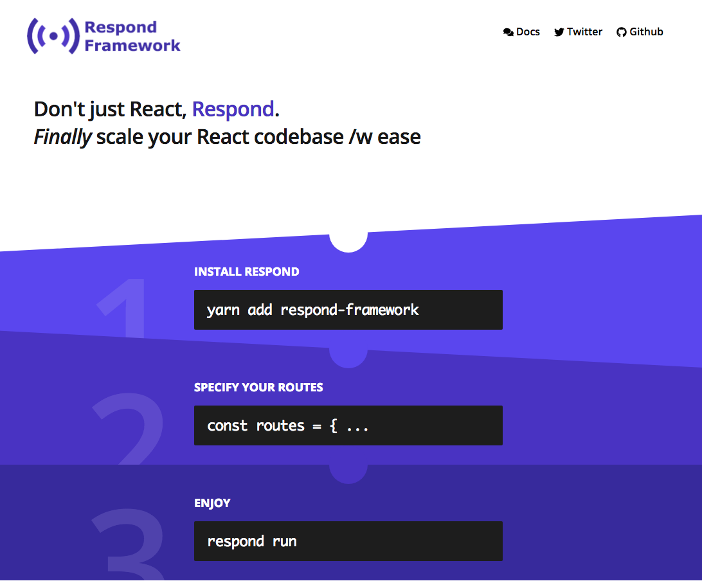

# Respond Framework Walkthrough




Respond Framework is the next evolution of the Redux legacy built for a hooks + suspense era. If you have loved Redux, but have been unsure where it now stands, you've come to the right place. 

Respond birthed out of one of the most important Redux libraries, [redux-first-router](https://github.com/faceyspacey/redux-first-router). Respond solves longstanding issues with Redux that serious app developers have been waiting for. It tackles crucial areas hooks/suspense are not focused on, providing a superior overall solution for large apps. Fortunately you don't have to pick--you can mix Respond with hooks. 

The *Redux Revival* starts here.


## Overview

Respond Framework is what happens if you make Redux **modular** and built it *directly* into React, while also building **routing** directly into the framework. The result being things made as easy as they were in the server-side MVC days, while gaining all the benefits modern javascript has brought in terms of modularly building large apps out of many small apps. 

It's a re-think of how we build our apps that captures the best of the old ways and new ways.

The birds eye view is this: 

- your apps can still be built from **request** and ***response*** building blocks like server-side MVC apps in olden times
- action dispatches within **"Respond modules"** are namespaced and therefore isolated from the rest of your app, finally allowing you to think in terms of *many mini Redux apps*

With Respond you can use all your hooks and suspense tricks at the microscopic component level, but *also* take a step back and get similar **modularity** at higher macro levels that more naturally represent application boundaries. The latter is a world first we have eagerly been awaiting.


Next Up: a quick overview of what you can do with Respond.

## Installation

```sh
yarn add 'respond-framework'
```


## "Redux Components"

Components receive additional arguments for "global" `state` and `actions`:

```js
function LoginComponent(props, state, actions) {
  const onClick = state.session ?  actions.logout : actions.login
  const text = state.session ? 'LOGOUT' : 'LOGIN'

  return (
    <div>
      <button onClick={onClick}>{text}</button>
    </div>
  )
}
```

But they aren't *global*. Rather, they are **collision-free** namespaced slices from the current module.

You will **NOT** have to `connect`, `mapState`, `useSelector`, or `useDispatch` anywhere in your Respond app. This is what we mean by "the store is built **directly** into React."


## Respond Modules

Components are in fact just one of the ingredients of "Respond Modules."

A Respond module contains  **routes**, **components**, **reducers**, **middelware** and various configuration **options**. 

Respond modules are encapsulated like React components, but at a *higher level*. They give you a birds-eye perspective of important portions of your app. They let you define application boundaries more broadly and flexibly than components. 

Because Respond modules are both modular and can encompass *all* aspects of an app, they enable separate developer teams to go off with confidence that they can build large feature sets which will plug in nicely.

A minimal module might contain just routes, components and reducers:

```js
import { createModule } from 'respond-framework'
import Link from 'respond-framework/link'

export default createModule({
  routes: {
    home: '/',
    login: '/login'
  },
  components: {
    App: (props, state, actions) => (
      <div>
        <h1>My App</h1>
        <h2>page: {state.page}</h2>
        <Link to={actions.login}>Login</Link>
      </div>
    )
  },
  reducers: {
    page: (state = 'Home', action, types) => {
      switch(action.type) {
        case types.LOGIN:
          return 'Login'
        case types.HOME:
          return 'Home'
        default:
          return state
      }
    }
  }
})
```


However, to get the full benefit of a module system, you must have at least 2, which are able to be used together without naming conflicts:

*src/modules/app/index.js*

```js
import { createModule } from 'respond-framework'
import ReactDOM from 'react-dom'
import middlewares from './middlewares'
import reducers from './reducers'
import components from './components'

const { firstRoute, store } = createModule({
  middlewares,
  reducers,
  components,
  initialState: window.RESPOND_STATE,
  routes: {
    home: '/',
    login: '/login',
    dashboard: {
      path: '/dashboard',
      load: () => import('../modules/dashboard'),
      moduleProps: {
        state: {
          user: state => state.session
        },
        actions: {
          logout: actions => actions.logUserOut
        }
      }
    }
  }
})

(async function() {
  await store.dispatch(firstRoute())

  ReactDOM.hydrate(
    <Provider store={store}>
      <App />
    </Provider>,
    document.getElementById('root')
  )
})()
```


*src/modules/dashboard/index.js:*

```js
import { createModule } from 'respond-framework'
import reducers from './reducers'
import Content from './components/Content'

export default createModule({
  reducers,
  components: {
    Dashboard: (props, state, actions) => (
      <div>
        <h1>Welcome, {state.user.firstName}</h1>
        <Content />
        <span onClick={actions.logout}>Logout</span>
      </div>
    )
  },
  routes: {
    main: '/',
    metrics: '/metrics',
    stats: '/stats'
  }
})
```

Here for the first time we see the top level module kickstarting an app using `ReactDOM.hydrate` and the dispatching of `firstRoute()` on the store. This is very similar to the pattern established by [faceyspacey/redux-first-router](https://github.com/faceyspacey/redux-first-router).

`moduleProps` however is the star. They are the glue that binds multiple modules together. They allow you to share `state`, `actions`, and `types` between parent modules and their children, while using a single time-travellable store. The Redux devtools still work with Respond!

To use them, assign a retrieval function to keys the child accepts. On the child, they are conveniently available via property access, rather than a function.

> The React team has done an astounding job pinpointing the least amount of API surface to comprise the component primitive. Respond follows the same rigorous path but on the other end of the spectrum: "mini apps." One is the perfect primitive for *micro* level components and the other for *macro* level mini apps. 


## No More JSX, no createElement

JSX is in fact optional with Respond. Imagine if your components rendered by virtue of function calls:

```js
function Login({ color }, state, actions) {
  const onClick = state.session ?  actions.logout : actions.login
  const text = state.session ? 'LOGOUT' : 'LOGIN'

  return div({
    style: { color },
    children: button({ onClick }, text)
  })
}

const NavBar = props => div([Logo(), NavLinks(), Login({ color: 'pink' })])

const App = props => [
  NavBar(),
  Content(),
  Footer({ year: '3019', [
    FirstColumn(),
    SecondColumn(),
    ThirdColumn()
  ])
]
```

The key element is that component boundaries still exist, allowing component to re-render independently if `setState` is called.

Previous advocates of dropping JSX would have you write extra function calls throughout your codebase like so:

```js
const NavBar = props => (
  React.createElement(div, {}, [
    React.createElement(Logo),
    React.createElement(NavLinks),
    React.createElement(Login, { color: 'pink' })
  ])
)
```

Yuck! What we are doing is very different and far more natural. What you're building finally feels like one big pure function. 

Behind the scenes Respond detects components created from regular functions and wraps them in `React.createElement` for you. That way you don't have to:

```js
const NavBarInner = props => div([Logo(), NavLinks(), Login({ color: 'pink' })])
const NavBar = (props, children) => createElement(NavBarInner, props, children)
```

Now your code can just call `NavBar(props)`.

This opens the doors for learners to learn just one language, not 3+ (HTML, CSS, and javascript). It's functions all the way down, which goes hand in hand with the React team's "hooks" initiative. That's far less friction and far more onboarded learners. 

For advanced developers, it means one highly dynamic language to rule them all, less context switching. All you code is functions. Respond makes it so 99% of your app is pure functions. `App = f(state)` is finally a reality.

With things like Web Assembly, we believe the overall vision for the web and GUI development is one without HTML and CSS, at least when it comes to the API we use. It can still exist under the hood (for as long as necessary), but it's not what we rely on for our work. 

This is the future Respond is in the process of creating.

## Predictable Linear Effects

No longer leave side-effects up to random discovery in your component tree!  

> ["No surprises == better sleep"](https://twitter.com/faceyspacey/status/1107057805507227649) -Anton Korzunov (maintainer of react-hot-loader, react-imported-component)

Instead orchestrate them linearly once per route. 

Trust us, React is great--**why do you think** ***Respond*** **is built on top of it**--but that doesn't mean React has the final say on the best way to build your apps. Data-fetching side-effects don't belong in your components, even with hooks + suspense. And other fx now have other options.


### Here's how we roll:


```js
export default createModule({
  reducers,
  components,
  routes: {
    main: {
+      path: '/',
+      thunk: ({ api }) => api.get('items')
    },
    metrics: '/metrics',
    stats: '/stats'
  }
})
```

### Or if you're old school:

```js
export default createModule({
  reducers,
  components,
  routes: {
    main: {
      path: '/',
+      thunk: async ({ api, dispatch, types }) => {
+        const payload = await api.get('items')
+        dispatch({ type: types.main.COMPLETE, payload })
      }
    },
    metrics: '/metrics',
    stats: '/stats'
  }
})
```

In the first option the return, `api.get('items')`, is automatically dispatched with type `types.main.COMPLETE`. There's a lot less dispatching with Respond than with Redux classic.

`types` here is supplied via dependency injection to avoid conflicts. Under the hood the, insead of `'COMPLETE'`, the type might be `'dashboard/COMPLETE'`. 

The arguments passed to components and reducers behave the same way. By leaving it to Respond, you're free to mix and match modules which may share similar names for reducers, types, etc. 

> As seemingly small as this is, modular namespacing is the one thing that's been holding Redux back from allowing you to build large apps out of smaller mini apps, which is the cornerstone of first class software development process. It's also why the React team has invested so much in making components--which are already modular--do the things Redux exels at. They are both needed, one at the *micro* level and the other at the *macro* level.

Creators that have built significant apps know how monumental this is. As a bonus, it also means no more boilerplate importing this stuff everywhere.


### Add callbacks that fire for all routes:

You can also add callbacks that fire for every route in the 2nd options argument:

```js
import mixpanel from 'mixpanel'

export default createModule({
  reducers,
  components,
  routes: {
    main: {
      path: '/',
      thunk: ({ api }) => api.get('items')
    },
    metrics: '/metrics',
    stats: '/stats'
  }
}, {
+  onEnter: ({ location }) => mixpanel.track('dash', location)
})
```

> they are run in parallel to route-specific ones

### Bail out using redirects before route changes:


```js
export default createModule({
  reducers,
  components,
  routes: {
    main: {
      path: '/',
      thunk: thunk: ({ api }) => api.get('items')
    },
    metrics: '/metrics',
    stats: '/stats'
  }
}, {
+  beforeEnter: async ({ getState, actions }) => {
+    if (!getState().session) {
+      return actions.login() // remember, the login action was passed as a `moduleProp`
+    }
+  },
  onEnter: ({ location }) => mixpanel.track('dash', location)
})
```

> `beforeEnter` could just as easily been added to individual routes


### Bail out on leave:


```js
export default createModule({
+ reducers: { session, acceptedCookies },
  components,
  routes: {
    main: {
      path: '/',
      thunk: ({ api }) => api.get('items'),
+     onLeave: ({ getState }) => !getState().acceptedCookies // return false to block route change
    },
    metrics: '/metrics',
    stats: '/stats'
  }
}, {
  beforeEnter: async ({ getState, actions }) => {
    if (!getState().session) {
      return actions.login()
    }
  },
  onEnter: ({ location }) => mixpanel.track('dash', location)
})
```


## 100% Customizable Middleware

The backbone of Respond is our routing slash side-effects library, *Rudy*, which is hard at work under the hood. *Rudy* offers an async middleware API similar to [koa-compose](https://github.com/koajs/compose) with "rewind."

What this means is that each middleware asynchronously gets a chance to operate on the `route` before passing the request to the next middleware in the chain. 

> classic Redux offers a synchronous middleware API, ours is async to meet the demands of today.

The above `routes` could be minimally served with this custom middleware pipeline:

```js
export default createModule(config, options, [
+  transformAction, 
+  call('beforeEnter'),
+  enter,
+  call('onLeave', { prev: true }),
+  call('onEnter'),
+  call('thunk', { cache: true }),
])
```

All the callback names passed to `call` are available as keys on your routes and executed at the appropriate time during route transitions. The `call` middleware has many other super powers like automatic dispatch of returns.

Each middleware also has a 2nd chance to peform work as the chain "rewinds." This gives us great control over route transitions. 

For example, we can bail out at any time (before or after `enter`). We have even figured out how to do this in bail-outs triggered by browser back/next buttons, thanks to our custom `History` package within core. *By the way, our `History` is truly one of a kind--first in the world to keep track of browser history `entries`; more on that to come...*

> If you're wondering, yes, you can still use the traditional Redux enhancer/middleware APIs like the Devtools and Sagas


## Generated Action Creators & Types

Your `routes` object generates all the action types your application needs. So for these routes:


```js
const routes = {
  HOME: '/',
  CHECKOUT_STEP_1: '/checkout/step-1',
  CHECKOUT_STEP_2: '/checkout/step-2',
  DASHBOARD: {
    path: '/dashboard',
    routes: {
      METRICS: '/metrics',
      STATS: '/stats'
    }
  }
}
```

The following camelCased creators will be generated:

| Action Creator | Dispatched Type | 
| --- | --- |
| `actions.home()` | `type: 'HOME'`| 
| `actions.checkoutStep1()` | `type: 'CHECKOUT_STEP_1'`|
| `actions.checkoutStep2()` | `type: 'CHECKOUT_STEP_1'`| 
| `actions.dashboard()` | `type: 'DASHBOARD'`|
| `actions.dashboard.metrics()` | `type: 'DASHBOARD/METRICS'`| 
| `actions.dashboard.stats()` | `type: 'DASHBOARD/STATS'`|

> the route type `DASHBOARD` becomes the namespace for nested routes/modules


### Additional Action Creators

For each route you also get several additional action creators. Let's take `HOME` as an example:


| Action Creator | Dispatched Type | 
| --- | --- |
| `actions.home.complete()` | `type: 'HOME.COMPLETE'`| 
| `actions.home.error()` | `type: 'HOME.ERROR'`|
| `actions.home.start()`* | `type: 'HOME.START'`| 

> **see [call({ start: true })]('./docs/call-middleware.md#start') for when you might use `START`*


### Injections 

Because *Respond Modules* are guaranteed to be unaware of the outside world **(even though they're conveniently using the same store)**, `actions`, `types` and `state` must be injected by the framework. 

This allows Respond to transparently normalize namespace access under the hood, so you only have to use namespaces where you absolutely must. Let's take a look at where `actions` appear:


***callbacks:***

```js
MY_ROUTE: {
  thunk: ({ actions }) => ...,
} 
```

***reducers (as `types`):***

```js
reducers: {
  foo: (state, action, types) => types.home ? true : state
}
```

***components:***

```js
const MyComponent = (props, state, actions) =>
  <Button onClick={actions.metrics()} />
```

Children won't be able to access any actions, state, or types of the parent (or siblings) though. They are a fully isolated world all their own.

Parents however can access aspects of children. They must do so via the fully qualified namespace:

```js
const ComponentInParentModule = (props, state, actions) =>
  <Button onClick={actions.dashboard.metrics()} />
```

In other words, parents get to know whats up with their children, but not the other way around *(like in real life).*

You however can explicitly work around this arrangement. For example, child modules can know about sibling modules if explicitly given access through the shared parent via `moduleProps`:

```js
routes: {
  home: '/',
  login: '/login',
  dashboard: {
    path: '/dashboard',
    load: () => import('../modules/dashboard'),
    moduleProps: {
      state: {
        foo: state => state.sibling.foo
      }
    }
  },
  sibling: {
    path: '/sibling',
    load: () => import('../modules/sibling')
  }
}

const DashboardComponent = (props, state) => <div>{state.foo}</div>
```

This is the same pattern as *"lifting state"* in traditional React. We have to admit: putting existing React skills to use with this pattern is quite refreshing. Being able to do the same on both *micro* and *macro* levels feels correct.


### Dispatching

Dispatching route actions offer some conveniences. Imagine we have this route:

```js
MY_ENTITY: '/entity/:slug',
```

You could dispatch that as an action without the type:

```js
const v = {
  params: { slug: 'dope-stuff' },
  query: { foo: 'bar' },
}

actions.myEntity(action)
```

Or if you only needed the params, Respond offers a bit of automation:

```js
const params = { slug: 'dope-stuff' }
actions.myEntity(params)
```

Respond will detect any object that doesn't have any of the action keys as just the `params`.


### Dispatching Complete

The returns of callbacks are automatically dispatched, assigned to the payload like so:

```js
MY_ENTITY: {
  path: '/entity/:slug',
  thunk: ({ api }, { params }) => api.get(`entity/${slug}`)
}
```

The exact action dispatched will be: `{ type: 'MY_ENTITY.COMPLETE', payload: [...itemsReturned] }`


To dispatch that manually you would do:

```js
MY_ENTITY: {
  path: '/entity/:slug',
  thunk: async ({ api }, { params }) => {
    const { items } = await api.get(`entity/${slug}`)
    actions.myEntity.complete(items)
  }
}
```


### Dispatching Errors

Now say you had an error:


```js
MY_ENTITY: {
  path: '/entity/:slug',
  thunk: async ({ api }, { params }) => {
    const items = await api.get(`entity/${slug}`)
    
    if (!items) {
      actions.myEntity.error(new Error('explosion'))
    }

    actions.myEntity.complete(items)
  }
}
```

The error type `MY_ENTITY.ERROR` would be dispatched like so:

```js
{ type: 'MY_ENTITY.ERROR', error: new Error('explosion') }
```

And you could retreive both from state at:

```js
state.location.errorType
state.location.error
```

Respond will also internally dispatch error actions if anything goes wrong. In *that case* `onError` callbacks you have on the route (or globally in your options) will be called. Checkout the [onError option](./docs/advanced-options.md#onerror-request-action-) to learn more.


### Binding Not Necessary

In components and route callbacks (which you saw above), actions are pre-bound to dispatch, so you never have to think about all the different ways it could be in *react-redux* (e.g. `bindActionCreators`, etc)

So never expect do see `dispatch`:

```js
const MyComponent = (props, state, actions) =>
  <Button onClick={() => props.dispatch(actions.home())} />
```

Instead you do just:

```js
const MyComponent = (props, state, actions) =>
  <Button onClick={actions.home()} />
```

Or if you had to pass arguments, you would get automatic memoization:

```js
const MyComponent = ({ arg }, state, actions) =>
  <Button onClick={actions.myEntity({ slug: arg })} />
```

That's because, `home()` and `myEntity()` return a memoized function reference that only changes if the arguments change. It's a minor automation over doing the following in *Modern React*:

```js
import { useCallback } from 'react'

const MyComponent = ({ arg }, state, actions) =>
  <Button onClick={useCallback(() => actions.myEntity( slug: arg }), [arg])} />
```

In both, a new function reference will be returned only if `arg` changes, improving your perf by short-circuiting unecessary renders. 


***What about in callacks?***

Respond knows when your action creators are being called in render *vs* in callbacks like this:


```js
const MyComponent = ({ arg1, arg2 }, state, actions) => {
  const handler = () => {
    // do something else
    actions.home()
  }

  return <Button onClick={handler} />
}
```

Therefore, you don't have to do this:  `actions.home()()`


### Usage w/ `<Link />`

However, the **recommended way to dispatch actions with Respond** is with the `<Link />` component. 

```js
import Link from 'respond-framework/Link'

const MyComponent = (props, state, actions) =>
  <Link action={actions.home} />
```

Given Respond is conducive to URLizing every state--and not to mention its automation of SSR--there's no reason you shouldn't use *real links* to dispatch all actions. 

Even in the private members areas of your apps where SEO is not an issue, links offer you many benefits:

- better accessibility
- visited coloring
- right click capability  *(open in new tab, etc)*
- **100% automated testing capabilities** 
- works fine with **React Native**, bringing the same automated testing capabilities there too


### Enhanced Testing w/ `<Link />` and `snapActions`

The Respond's `snapActions` test utility offers a 100% automated way of writing tests by simple dumps of actions from the Redux devtools. Typically you couldn't get tests this comprehensive without writing browser automation/scraping code, which is never fun, not automatic, and redundant in terms of actual app code you already wrote. 

Wierdly enough, we are able to fulfill the *ambition of complete automation* through snapshotting actual `hrefs` on the page (eg: `<a href='/' />`). This is something hidden handlers/actions cannot provide. The idea is: 

- **if the next action in the array matches a link with the given url/href on the page, the test runner can safely continue.**

Here's what usage of Respond's `snapActions` test runner looks like:


```js
import { snapActions } from 'respond-framework/test'
import actions from './actions/sequence-1'
import { App, config, options } from '../src'

test('my whole app', async () => {
  // called under the hood: createApp(config, options) + React.render(App)
  await snapActions(actions, App, config, options)
})
```

`snapActions` dispatch each action in the `actions` array one by one, followed by a snapshot of the resulting JSX and the resulting state:

It **confirms it can dispatch the next action by the presence of the corresponding url/href in the JSX; no recording clicks necessary!**

If an action with a corresponding URL does not appear in the JSX, the test will fail. 
 
Say good bye to slow end-to-end tests with Respond (at least while you're working and want fast results). 
 
Lastly, the same `snapActions` can open a real browser using [Cypress](https://www.cypress.io), puppeteer or similar. So we have you covered in both situations. Take a look:


```js
import { snapActions } from 'respond-framework/test'
import actions from './action-sequences'
import { App, config, options } from '../src'

test('my whole app', async () => {
  await snapActions(actions, App, config, options, {
    visit: (url) => cy.visit(url),
    snapHtml: () => cy.get('html').snapshot(),
    snapPhoto: (filename) => cy.screenshot(filename)
  })
})
```

Typically, end-to-end tests are used during CI, and Jest snapshots while you're working, using a fast continuous test-runner like [Wallaby](https://wallabyjs.com).


### Custom Action Creators

On your routes you can also provide custom action creators like so:

```js
MY_ENTITY: {
  path: '/entity/:slug',
  actions: {
    go: slug => ({ params: { slug }}),
    another: (slug, state) ({ params: { slug }, state }),
  }
}
```

Now you will also have:
- `actions.myEntity.go(slug)`
- `actions.myEntity.another(slug, state)`

This simplifes the passing of args wherever you call these action creators. You don't have to recreate: 

- `{ params: { slug } }`
- `{ params: { slug }, state }`


### `actions.notFound`

Respond provides a built-in `NOT_FOUND` action type at the top level of your app. If a route is ever not found, this action type will be dispatched. You can also override it at any level of your modules hierarchy. Respond will dispatch the  `NOT_FOUND` type namespaced to the closest module that has one. 

You can put callbacks on it like you would any other route:

```js
const routes = {
  NOT_FOUND: {
    onEnter: () => alert('oops')
  }
}
```

If Respond can't find a route dispatched, `/not-found` will be the path set in the address bar. You can override that like any other route:

```js
const routes = {
  NOT_FOUND: {
    path: '/fail-whale',
    onEnter: () => alert('oops')
  }
}
```

If you choose to dispatch `NOT_FOUND` when something goes wrong (which is a fine pattern), this path will also be used.

However, if the URL in the route transition was pre-determined (such as from a direct visitor), but no matching route found, the URL will stay the same in the address bar, *while dispatching the `NOT_FOUND` type.* This is preferable in this case.


Lastly, `actions.notFound.complete` and other additional generated action creators also exist. There's very little different between `NOT_FOUND` and other routes, except Respond directs your users here as a fallback when things go wrong.


## Automatic Code Splitting

Respond automatically code splits your app. There's nothing you have to do about it, it just happens through normal use of modules using the `load` route option and a dynamic import:

```js
dashboad: {
  path: '/dashboard',
  load: () => import('../modules/dashboard')
}
```

which is equivalent to statically nested routes:

```js
dashboad: {
  path: '/dashboard',
  routes: {
    main: '/',
    metrics: '/metrics',
    stats: '/stats'
  }
}
```

`load` is resolved through a middleware. If you don't provide a `middleware` array, here's the default one:

```js
export default createModule(config, options, [
  serverRedirect,           // short-circuiting middleware       
  anonymousThunk,
  pathlessRoute('thunk')   
  transformAction,          // pipeline starts here
>  codeSplitModule('load'),  
  call('beforeLeave', { prev: true }),
  call('beforeEnter'),
  enter,
  changePageTitle,
  call('onLeave', { prev: true }),
  call('onEnter'),
  call('thunk', { cache: true }),
  call('onComplete')
])
```

The `codeSplitModule` middleware is responsible for insuring modules (including their components, reducers and route side-effects) are loaded before the route executes. **In other words, the plane is built while flying.**

Some middleware--**the "short-circuiting" middleware**--serves to perform a quick function before quickly exiting the pipeline. *Example:* handling anonymous thunks, or routes that have just a thunk but no path (which is a convenient way to consistently use the same route configuration object API).

## Seamless Prefetching


Routes can also be prefetched, including both their Webpack chunks and data dependencies which get cached.

**To prefetch** potential subsequent routes, return a list of them from the current route using the `prefetch` handler:

```js
routes: {
  login: '/login',
  home: {
    path: '/',
    prefetch: ({ actions, types, getState }) => [
      types.login,
      actions.profile({ params: { id: getState().user.slug }})
    ]
  },
  profile: {
    path: '/profile/:slug',
    thunk: ({ api, params }) => api.get(`users/${params.slug}`)
  }
}
```

If you provide a precise action, both the chunk *and callbacks such as thunks* will be called (with their results **cached**, aka stored in Redux).

If you, supply just a string as in `types.login`, only the chunk for the matching route will be called (since thunks wouldn't know what to fetch without precise params/etc).


## Serve Chunks w/ SSR

SSR is challenging. Code Splitting is challenging. But doing both together is many times harder.

With Respond it's *just* a matter of passing the `request` `url` and *awaiting* your `firstRoute()`. 


*server/configureStore.js:*
```js
import { createApp } from 'respond-framework'

export default async function configureStore(request) {
  const options = {
    initialEntries: [request.url]
  }

  const { firstRoute, store } = createApp(config, options)

  await store.dispatch(firstRoute())

  return store
}
```

And then extracting used chunks from state (yes, Respond is aware of your Webpack chunks):

*server/serverRender.js:*
```javascript
import ReactDOM from 'react-dom/server'
import { Provider } from 'respond-framework'
import configureStore from './configureStore'
import App from '../src/components/App'

export default async function serverRender(req, res) {
  const store = await configureStore(req)

  const state = store.getState()
  const appString = ReactDOM.renderToString(<Provider store={store}><App /></Provider>)
  const stateJson = JSON.stringify(state)

  // like this:

  const { chunks } = state.location

  const stylesheets = chunks.map(chunk => {
    return `<link rel='stylesheet' href='/static/${chunk}.css' />`
  }).join(' ')

  const scripts = chunks.map(chunk => {
    return `<script src='/static/${chunk}.js' />`
  }).join(' ')

  return res.send(
    `<!doctype html>
      <html>
        <head>
          ${stylesheets}
        </head>
        <body>
          <div id="root">${appString}</div>
          <script>window.RESPOND_STATE = ${stateJson}</script>
          <script src="/static/bootstrap.js" />
          <script src="/static/vendors.js" />
          ${scripts}
        </body>
      </html>`
  )
}
```

*server/index.js:*
```js
import express from 'express'
import serverRender from './serverRender'

const app = express()
app.get('*', serverRender)
http.createServer(app).listen(3000)
```

SSR with *Respond* doesn't lock you into a *"walled garden"* (like other solutions). You can use Express, Koa, Node, Babel and Webpack as you normally would.


Yes, we wrote the book when it comes to routing, splitting and SSR, especially in a Redux world. ***Respond Framework*** **is the direct heir to:**

- **[faceyspacey/redux-first-router](https://github.com/faceyspacey/redux-first-router)** and 
- **[faceyspacey/react-universal-component](https://github.com/faceyspacey/react-universal-component)**


## Baked-in Redux (check out our sweet Components!)

Internally, our state management library is called *Remixx*, but it's ok if you continue to call it *"Redux"* :)

"Redux Modules"--*you know the ones the community never figured out how to make*--was always about components. The idea is that you can provide a pairing of Redux assets (reducers, actions, types) and components in a format that you can share with 3rd parties without naming conflicts (such as through NPM). In other words: **mini apps**. *It would have been nice, but when was the last time you saw Redux-based components on NPM??* **Not usefully now.**

While making this possible, we took the liberty to build in exactly what you might expect into React. Here's what *Respond components* look like:

```js
const LoginButton = (props, state, actions) => !state.session && <Button onClick={actions.login} />
```

**`state` and `actions` are passed as arguments in addition to props!** 

Actions are automatically bound to `dispatch` and there's never any need for `mapStateToProps`. Under the hood proxies are used to track your actual usage of state so re-renderings only occur if the precise nested piece of state you accessed has changed. *This applies both to reducers and selectors. More on selectors below.*

> Yes, *Respond* is built for the era where you assume your users' browsers support proxies.

The transformation of your components to support this interface is done via Babel, therefore if you don't happen to use `state` or `actions`, your components will be left untouched. You're free to use hooks, side effects, you name it (though we recommend keeping your side-effects in *Respond* routes, especially if you're doing SSR).


## Automatic Namespacing

If you saw:

```js
import { Link, createModule } from 'respond-framework'

const MetricsButton = (props, state, actions) => {
  const text = state.foo ? 'Go To Metrics' : 'metrics' // contrived example

  return (
    <div>
      <Link to={actions.metrics}>{text}</Link>
    </div>
  )
}

export default createModule({
  reducers: { foo, bar },
  components: {
    Dash: (props) => {
      return (
        <div>
          <MetricsButton />
        </div>
      )
    }
  },
  routes: {
    main: '/',
    metrics: '/metrics',
    stats: '/stats'
  }
})
```

and were wondering how `actions.metrics` and `state.foo` was guaranteed to be unique if this component was part of a module on NPM, *you'd be a keen observer.*

Under the hood (within the `state` and `actions` proxies) here's what's actually being called:

```js
const MetricsButton = (props, state, actions) => {
  const text = state.dashboard.foo ? 'Go To Metrics' : 'metrics'

  return (
    <div>
      <Link to={actions.dashboard.metrics}>{text}</Link>
    </div>
  )
}
```

That's because the component knows what module it's part of. It doesn't need to provide its own namespace. It wouldn't even work if it tried. *Respond components* have no awareness of the outside world *unless it's told about it.*

Like import aliasing in ES6 modules, the namespace is *assigned in the parent module*. Remember this:

*src/modules/app:*

```js
dashboad: {
  path: '/dashboard',
  load: () => import('../modules/dashboard'),
}
```

> The parent route type, `DASHBOARD` doubles as the module's namespace for nested routes


## Module Props

Modules can receive `props` just like components can. The purpose is different though: 

- **`moduleProps` serve the purpose of aliasing existing `state`, `actions` & `types` coming from parent modules**
- **and therefore keep all state in a** ***single easily time-travellable + testable store*** 

Here's how you tell the `dashboard` module about pre-existing state and actions in the parent:

```js
dashboad: {
  path: '/dashboard',
  load: () => import('../modules/dashboard'),
+  moduleProps: {
+    state: {
+      user: 'session'
+    },
+    actions: {
+      login: 'login'
+    },
+    types: {
+      CLOSE: 'HOME'
+    }
+  }
}
```

`getState().user` will be made available through the `state` proxy at `state.session` and the equivalent for `actions.login` in the `actions` proxy. It's just coincidence that the child module documents an expected action by the same name of `login`.

You can also use functions instead of strings:

```js
moduleProps: {
  state: {
    user: state => state.session
  }
}
```

Within the child module, access will still be `state.user`, rather than `state.user()`.

## Module Parameterization 

At the end of the day component `props` are just parameters. Our modules also can be parameterized. The difference from `moduleProps` is that there is no special behavior under the hood. 

If you wanted to choose paths used in a child module from the parent, here's how you would do it:


```js
import { createModule } from 'respond-framework'

export default options => createModule({
  routes: {
    OPEN_CART: {
      // path: '/cart',
      path: options.openCartPath, // <--
      thunk: ({ stripe, payload }) => stripe.findCartItems(payload)
    },
    CHARGE: {},
    CONFIRMATION: {}
  }
})
```

*parent module/app:*

```js
CHECKOUT: {
  load: async () => {
    const module = await import('respond-stripe-cart')
    return module({ openCartPath: '/all-i-do/is-win' })
  }
}
```


## Modules, Nesting, Splitting, Oh My!

The cornerstone of Respond's pristine interface is one thing: **the collapsing of many capabilities under one interface:** ***Respond Modules.*** 

Let's take a look at how dynamically imported routes look like after being merged:


**before:**
```js
// parent module:
routes: {
  dashboard: {
    path: '/dashboard',
    thunk: ({ api }) => api.get('user'),
    load: () => import('../modules/dashboard'),
  }
}

// child dashboard module:
routes: {
  metrics: '/metrics',
  stats: '/stats'
}
```

**after:**
```js
routes: {
  dashboard: {
    path: '/dashboard',
    thunk: ({ api }) => api.get('user'),
    routes: {
      metrics: '/metrics',  // reified path /dashboard/metrics
      stats: '/stats'       // reified path /dashboard/stats
    }
  }
}
```

As you can see, modules, path nesting, and code splitting are all **collapsed** into a single unified interface.

But that's not all, the `thunk` above has a special characterstic we call **"callback nesting"**: 

- it's called even if you visit `/dashboard/metrics` directly
- it's not called if you navigate from `/dashboard/metrics` to `/dashboard/stats` though

It's only called on first entrance of the given group of nested routes/module. The common use case for this is to insure that the `user` or `session` object exists for all dashboard routes, without having to code the call for every route.


Let's check out a few more scenarios:


### Use a different path prefix than the parent:

```js
routes: {
  dashboard: {
    path: '/dashboard',
    pathPrefix: '/something-else',
    thunk: ({ api }) => api.get('user'),
    routes: {
      metrics: '/metrics',  // reified path /something-else/metrics
      stats: '/stats'       // reified path /something-else/stats
    }
  }
}
```


### Leaving out the parent module path:

```js
routes: {
  dashboard: {
    thunk: ({ api }) => api.get('user'),
    routes: {
      metrics: '/metrics',  // reified path /metrics
      stats: '/stats'       // reified path /stats
    }
  }
}
```

> In essence, the route nesting is being used just for callback nesting + module namespacing; usually you can visit: `actions.dashboard()`, since the namespace doubles as its own route; in this case you can't. 


### Leaving out the parent module path:

```js
routes: {
  dashboard: {
    path: '/dashboard',
    pathPrefix: false,
    thunk: ({ api }) => api.get('user'),
    routes: {
      metrics: '/metrics',  // reified path /metrics
      stats: '/stats'       // reified path /stats
    }
  }
}
```

> This allows you to dispatch `actions.dashboard()` and reach an independent route as you originally could, while allowing for child routes to be unprefixed. It's a hybrid of the previous ones.


### Merge single child route into parent:

```js
// pre-import:
dashboard: {
  path: '/dashboard',
  load: () => import('../modules/dashboard'),
}

// dashboard module:
routes: {
  entry: {
    path: '/foo/:param',
    thunk: ({ api }) => api.get('user'),
  }
}

//post-import:
routes: {
  dashboard: {
    path: '/dashboard/foo/:param',
    thunk: ({ api }) => api.get('user'),
  }
}
```

> If a child route is named `entry` it will be merged into the parent, and it's path appended to the parent's. Within itself the child must refer to this action as `entry` obviously. 

> NOTE: no additional routes at the same level as `entry` are allowed. You can nest them further though.


## Reducers & Selectors

In *Respond*, selectors are also passed at time of store creation. In addition, both reducers and selectors are automatically combined.

```js
export default createModule({
  reducers: { foo, bar },
  selectors: {
    visibleCurrentItems: (state, before, after) => {
      const items = state.items[state.filter]
      return items.filter(item => item.date < before && item.date > after)
    }
  },
  etc
})
```

What gives?

The difference between reducers and selectors is:

- selectors have access to all those isolated reducers *and* other selectors. 
- selectors are often intended to be used with arguments from components (i.e. `props`)

Which is why it makes a whole lot of sense, in a world where you're no longer doing the `mapStateToProps` rigamarole, to have functions on your `state` object, a la:

```js
const ItemsList = (props, state) => {
  const items = state.visibleCurrentItems(props.before, props.after)

  return (
    <>
      {items.map(item => (
        <div>
          <h1>{item.title}</h1>
          <p>{item.blurb}</p>}
        </div>
      ))}
    </>
  )
}
```


> As far as perf, we automated render trigger/blocking like with reducers, using a combination of usage tracking + caching. Unlike the days of *reselect*, a single selector automatically works across multiple components. Think of your `state` object, containing both reducers + selectors, as your **UI Database**.


## Action + Reducer Shape

Having learned from [redux-first-router](https://github.com/faceyspacey/redux-first-router), *Respond* route `actions` and `location` reducer state contain the richest set of info we could dream up. Our entire wishlist has been met. Their shape is identical. Let's check it out:

```js
{
    type: 'ARTICLE',
    namespace: 'blog',

    params: { slug: 'respond-rocks' },
    query: {},
    state: {},
    hash: 'action-shape',
    basename: 'en',

    url: '/en/article/respond-rocks#action-shape',
    pathname: '/article/respond-rocks',
    search: '',

    key: 123456,
    index: 1,
    length: 2,

    entries: [
      {
        type: 'HOME',
        namespace: 'blog',
        params: {},
        query: { referrer: 'your-blog-article' },
        state: {},
        hash: '',
        basename: 'en',
        key: 123456,
        index: 0,
      },
      {
        type: 'ARTICLE',
        namespace: 'blog',
        params: { slug: 'respond-rocks' },
        query: {},
        state: {},
        hash: 'action-shape',
        basename: 'en',
        key: 123457,
        index: 1,
      }
    ],

    from: {}, // route redirected from
    prev: {
      type: 'HOME',
      namespace: 'blog',
      params: {},
      query: { referrer: 'your-blog-article' },
      state: {},
      hash: '',
      basename: 'en',
      key: 123456,
      index: 0,
    },

    n: 1, // 1 | -1 (numerical version of direction)
    kind: 'push', // init | load | push | replace | back | next | reset | jump | set
    direction: 'forward', // forward | backward

    blocked: null,
    pop: false,
    status: 200,
    ready: true
  }
}
```

## Request Shape:

The middleware pipeline generates a `request` instance object each time an action runs through it. It has the following shape:

```js
{
  ...options.inject, // eg: { api }

  state: {},
  location: {},

  cache: {},
  error: {},

  title: '',

  route: {
    type: 'ARTICLE',
    path: '/article/respond-rocks',
    thunk: () => ...,
  },
  prev: {
    type: 'HOME',
    path: '/',
  },

  routes: {},
  actions: {},
  history: {},

  // unique object per pipeline (though ref maintained in child redirect pipelines)
  tmp: {
    committed: true,
    load: false,
  },
  
  // same object reference across all requests
  ctx: {
    pending: false,
    busy: true,
  },

  dispatch() {},
  confirm() {},
  block() {},
  enter() {}
}
```

> There are other keys on the `request` object which are used internally; disregard them as they are not part of the public API and could change

Commonly you will access a `request` instance in a route callback like so:

```js
ARTICLE: {
  path: '/article/:slug',
  thunk: (request, action) => {
    const { api } = request
    const { params } = action
    return api.get(`article/${params.slug}`)
  }
}
```

## Submitting Forms

Submitting forms follows a precise pattern with Respond. Instead of buttons linking to pathful routes, pathless routes are used to submit the form data, and on completion redirect to a pathful route.

```js
// imagine you're on /draft/my-article-on-how-dope-respond-is

EDIT_DRAFT: {
  path: '/draft/:slug',
  thunk: ({ api }, { params }) => api.get(`draft/${params.slug}`)
},


// you click <Button onClick={actions.submitDraft} />

SUBMIT_DRAFT: {
  thunk: async ({ api }, { payload }) => {
    const { success, message } = await api.post('article', payload)
    return success ? actions.drafts() : actions.flash(message)
  }
},


// and you end up back here

DRAFTS: {
  path: '/my-drafts',
  thunk: ({ api }) => api.get('drafts') // token added to request headers by api instance
}
```


## Login + Auth Token

Login/Signup forms and receiving auth tokens follows a similar pattern to basic form usage:

### example:

```js
// you're here:

LOGIN: {
  path: '/login',
},


// you click <LoginButton onClick={actions.submitLogin} />

SUBMIT_LOGIN: {
  thunk: async ({ api }, action) => {
    const { email, password } = action.payload
    const { success, message } = await api.login(email, password) // token received

    return success ? actions.drafts() : actions.flash(message)
  }
},


// and you end up at the main page of your private member area

DRAFTS: {
  path: '/my-drafts',
  thunk: ({ api }) => api.get('drafts') // token applied to request headers by api instance
}
```

The difference between regular form submits and login forms is: 

- `api.login` should receive an auth token which it stores within the `api` instance
- `api` automatically uses the token for subsequent requests, such as `api.get('drafts')`.

The token should also be persisted in `localStorage` (or cookies if you're doing SSR),
so you can pass it to your `api` instance during store creation.

If you're app doesnt have SSR, you can use [redux-persist](https://github.com/rt2zz/redux-persist), and get it from there on store creation.


> for an example of an Api class check our DI doc: [Dependency Injection + Api class example](./dependency-injection.md)


## TODO

move the above sections into individual files in the /docs folder, and leave a minimal description + Table of Contents.


## Conclusion

So there you go--long standing ecosystem problems finally solved and just about every effective React concept consolidated/collapsed under one beautiful interface. GraphQL/Apollo middleware coming soon. Welcome to the **Rails of React**.
